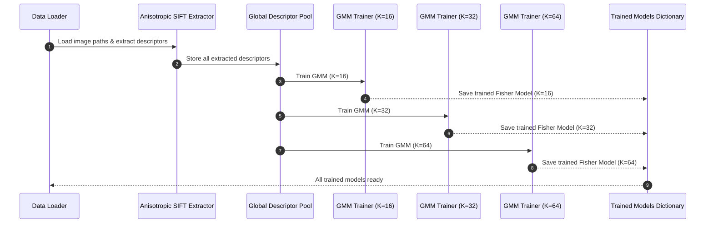

```mermaid
    sequenceDiagram
        autonumber
    
        participant Loader as Data Loader
        participant SIFT as Anisotropic SIFT Extractor
        participant Pool as Global Descriptor Pool
        participant GMM16 as GMM Trainer (K=16)
        participant GMM32 as GMM Trainer (K=32)
        participant GMM64 as GMM Trainer (K=64)
        participant Models as Trained Models Dictionary
    
        Loader->>SIFT: Load image paths & extract descriptors
        SIFT->>Pool: Store all extracted descriptors
    
        Pool->>GMM16: Train GMM (K=16)
        GMM16-->>Models: Save trained Fisher Model (K=16)
    
        Pool->>GMM32: Train GMM (K=32)
        GMM32-->>Models: Save trained Fisher Model (K=32)
    
        Pool->>GMM64: Train GMM (K=64)
        GMM64-->>Models: Save trained Fisher Model (K=64)
    
        Models-->>Loader: All trained models ready
```