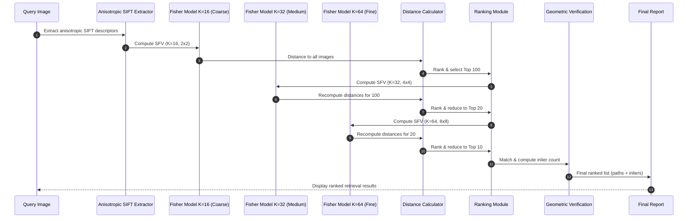

```mermaid
    sequenceDiagram
        autonumber
    
        participant User as Query Image
        participant SIFT as Anisotropic SIFT Extractor
        participant FM16 as Fisher Model K=16 (Coarse)
        participant FM32 as Fisher Model K=32 (Medium)
        participant FM64 as Fisher Model K=64 (Fine)
        participant Dist as Distance Calculator
        participant Rank as Ranking Module
        participant RANSAC as Geometric Verification
        participant Final as Final Report
    
        User->>SIFT: Extract anisotropic SIFT descriptors
    
        %% ----- Stage 1: Coarse -----
        SIFT->>FM16: Compute SFV (K=16, 2x2)
        FM16->>Dist: Distance to all images
        Dist->>Rank: Rank & select Top 100
    
        %% ----- Stage 2: Medium -----
        Rank->>FM32: Compute SFV (K=32, 4x4)
        FM32->>Dist: Recompute distances for 100
        Dist->>Rank: Rank & reduce to Top 20
    
        %% ----- Stage 3: Fine -----
        Rank->>FM64: Compute SFV (K=64, 8x8)
        FM64->>Dist: Recompute distances for 20
        Dist->>Rank: Rank & reduce to Top 10
    
        %% ----- Stage 4: RANSAC -----
        Rank->>RANSAC: Match & compute inlier count
        RANSAC->>Final: Final ranked list (paths + inliers)
    
        Final-->>User: Display ranked retrieval results

```