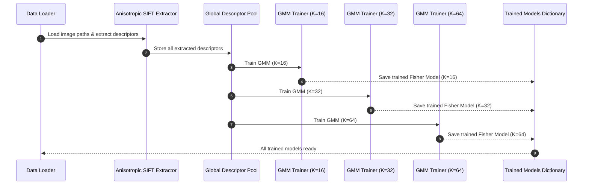
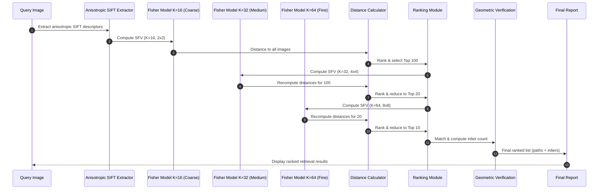

## List of Tables

**Table I:** [Experimental Setup](#table-i)
**Table II:** [Clothing Dataset (Full): Summary of Dataset Parameters](#table-ii)
**Table III:** [Class Distribution in the Clothing Dataset (Full)](#table-iii)
**Table IV:** [Multi Cancer Dataset (Kaggle) — Summary of Characteristics](#table-iv)
**Table V:** [Class Labels and Experimental Motivation](#table-v)
**Table VI:** [Flowers Dataset (Kaggle) — Summary of Characteristics](#table-vi)
**Table VII:** [Class Labels and Motivation for Experimental Use](#table-vii)
**Table VIII:** [Evaluation Metrics Description](#table-viii)
**Table IX:** [Summary of Experimental Results Across All Datasets](#table-ix)
**Table X:** [SIFT_ADHOC Results](#table-x)
**Table XI:** [ANSIOTROPIC_SIFT Results](#table-xi)
**Table XII:** [Runtime and Memory Comparison](#table-xii)

---

## List of Images

 **Figure 1:** [Sequence Diagram for Pre-processing]
 **Figure 2:** [Sequence Diagram for Query Image Retrieval]# An Anisotropic SIFT–Based Multi-Stage Coarse-to-Fine Image Retrieval Framework with Cross-Domain Evaluation

## I. Abstract

We propose a coarse-to-fine image retrieval framework that combines anisotropic SIFT descriptors with pyramidal Spatial Fisher Vector (SFV) representations for scalable and accurate visual search on large image collections. Local features are extracted using anisotropic SIFT in a diffusion-based scale space that preserves edges while suppressing noise, producing stable and discriminative descriptors. A global descriptor pool is used to train Gaussian Mixture Models (GMMs) with multiple vocabulary sizes, from which multi-level SFVs are computed over increasingly fine spatial grids.
To balance accuracy and efficiency, the framework employs a multi-stage retrieval strategy. Coarse SFVs with small vocabularies and coarse grids first retrieve an initial candidate set. Medium and fine stages then use larger vocabularies and finer spatial pyramids to re-rank only these candidates, significantly reducing expensive high-dimensional comparisons. Finally, RANSAC-based geometric verification is applied to top-ranked images to enforce geometric consistency and suppress false positives.
Experiments on Oxford Flowers, cancer-cell imagery, and apparel datasets demonstrate that the pyramidal coarse-to-fine design reduces end-to-end computation by restricting fine-grained comparison and geometric verification to a small candidate subset, while maintaining and improving retrieval precision. These results confirm the robustness and scalability of the proposed approach for modern computer vision systems and large-scale image retrieval applications.

## II. Introduction

The proliferation of high-resolution cameras, large-scale sensing infrastructures, and social media platforms has led to an exponential increase in the volume and complexity of digital imagery. This explosion of visual data has created a pressing need for efficient and accurate visual search systems. Modern applications across diverse domains, including e-commerce, biomedical imaging, and environmental monitoring, now rely on automated image analysis to interpret, classify, and retrieve content from massive repositories. As the scale of visual data continues to grow, conventional retrieval methods, which often depend on manual annotation or simple feature matching, are proving inadequate. They struggle to handle the computational load, storage requirements, and the sheer diversity of modern image collections, making it difficult to achieve high retrieval quality in a scalable manner. This challenge motivates the development of more advanced, scalable, and discriminative image representations and retrieval pipelines.

State-of-the-art image retrieval systems have traditionally been built upon local descriptors like SIFT and its variants, deep feature embeddings, or hybrid approaches that merge statistical modeling with spatial encoding. However, many real-world applications demand descriptors that are not only robust to noise and illumination changes but also sensitive to fine-grained structural details, all while remaining computationally tractable at scale. These requirements are especially critical in several key areas:

*   **E-commerce and Fashion**: The rise of visual search in online shopping has transformed how consumers discover products. Users now expect to find apparel and other items by simply providing a query image. This requires retrieval systems to be robust to variations in viewpoint, lighting, and background, while also being sensitive enough to distinguish between similar items with subtle differences in texture, pattern, or shape.

*   **Biomedical Imaging**: In fields like cancer diagnostics, precise visual pattern matching is essential for identifying malignant regions in pathology slides. By comparing a patient's tissue sample against a curated reference set, these systems can assist in early diagnosis and reduce the workload of expert pathologists. The complexity of cellular structures and the need for high precision make this a particularly challenging domain.

*   **Environmental Monitoring**: In botanical research, automated flower identification from in-the-wild photographs can support large-scale species cataloging and ecological monitoring. This requires descriptors that are robust to natural variations in lighting, background clutter, and the orientation of the flower.

Despite significant advances in deep learning and feature design, achieving high retrieval precision at the scale of millions or even billions of images remains a formidable challenge. This is particularly true for tasks that require sensitivity to subtle textures, complex biological morphologies, or rapidly changing product catalogs. These challenges have led to the development of multi-stage retrieval frameworks that offer a principled trade-off between speed and accuracy.

The proposed framework directly addresses this need by integrating anisotropic local feature extraction, pyramidal Spatial Fisher Vector modeling, and a hierarchical coarse-to-fine retrieval strategy, culminating in geometric verification. This approach is designed to deliver scalable, fine-grained visual search across a range of heterogeneous domains, providing a robust and efficient solution to the challenges of modern large-scale image retrieval.

## III. Related Work

Content-based image retrieval (CBIR) has evolved significantly over the past few decades, moving from simple global features to sophisticated local and deep-learning-based representations. The foundation of modern CBIR was built on hand-crafted local descriptors, with the Scale-Invariant Feature Transform (SIFT) being a seminal contribution [1]. SIFT's robustness to scale, rotation, and illumination changes made it a cornerstone of early retrieval systems, including the influential Video Google, which applied text retrieval concepts to object matching in videos [2]. Following SIFT, other descriptors like SURF (Speeded Up Robust Features) were developed to improve computational efficiency through the use of Hessian-based detectors and integral images [3]. However, a key limitation of these early methods was their reliance on isotropic Gaussian scale-space, which tends to blur fine structural details and edges. This has motivated the exploration of adaptive and anisotropic variants that can preserve these important features.

To overcome the limitations of raw keypoint matching, feature aggregation methods were introduced to encode local descriptors into a more compact and discriminative global signature. Techniques like the Fisher Vector (FV) [4] and Spatial Pyramid Matching (SPM) [5] have become fundamental to large-scale retrieval systems. FVs model the distribution of local descriptors using Gaussian Mixture Models (GMMs), while spatial pyramids capture both coarse and fine geometric relationships by dividing the image into a multi-level grid. These methods provide a powerful way to represent images, but their high dimensionality can pose a challenge for scalable indexing.

The need for efficient indexing of high-dimensional vectors has led to significant advancements in approximate nearest neighbor (ANN) search. Libraries like Faiss [6], which leverages product quantization and hierarchical indexing, have made it possible to perform similarity searches on a billion-scale with low latency. Coarse-to-fine retrieval strategies, which use multiple indexes or multi-level vocabularies, have also proven effective at improving efficiency by reducing the candidate set before applying more expensive verification steps [2], [7].

Geometric verification is another critical component of high-precision retrieval pipelines. RANSAC (Random Sample Consensus) [8] and its improved variants, such as LO-RANSAC [9], enforce geometric consistency by estimating transformations between matched keypoints. This step is crucial for eliminating false positives and ensuring that the retrieved images are not just visually similar but also geometrically aligned.

More recently, deep learning has revolutionized the field of image retrieval by enabling models to learn global embeddings directly from data. CNN-based aggregation [10], deep convolutional feature weighting [11], and large-scale retrieval surveys [12] have demonstrated significant progress in representation learning. In specialized domains like fashion retrieval, datasets such as DeepFashion [13] and models for visual compatibility and cross-domain matching [14], [15] have greatly improved semantic-level understanding. However, while deep models excel at category-level retrieval, many still struggle with the fine-grained geometric distinctions required for exact instance matching.

Despite these advances, there remains a need for systems that can unify robust local descriptors, discriminative spatial aggregation, scalable ANN search, and precise geometric verification. Hierarchical coarse-to-fine pipelines, combined with powerful feature representations, offer a promising path toward balancing accuracy and scalability. Our system builds on this extensive body of work by integrating anisotropic SIFT-based features, spatial Fisher Vectors, multi-index Faiss retrieval, and RANSAC verification into a cohesive architecture designed for high-precision visual matching.## IV. Methodology

The proposed image retrieval framework is architected as a multi-stage, coarse-to-fine system designed to strike a balance between high retrieval accuracy and computational efficiency. The methodology is logically divided into two main phases: an offline phase for model construction and descriptor indexing, and an online phase for processing query images and retrieving results. This structured approach allows for the systematic evaluation of the framework's performance on large-scale, heterogeneous image collections.

### Offline Phase: Model Construction and Indexing

The offline phase is computationally intensive and is responsible for building the visual representations that the online retrieval will depend on. This phase consists of three main steps: local feature extraction, global descriptor aggregation and modeling, and multi-level indexing.

**1. Anisotropic SIFT Feature Extraction**

The foundation of our framework is a robust local descriptor. We employ an **Anisotropic SIFT** descriptor, which enhances the standard SIFT by replacing its isotropic Gaussian scale-space with an anisotropic diffusion process. In a standard SIFT pipeline, the image is progressively blurred using a Gaussian filter. This process, known as isotropic diffusion, applies the same level of smoothing in all directions, which can unfortunately degrade important structural information by blurring sharp edges and fine textures.

In contrast, anisotropic diffusion adapts the smoothing process to the local image content. It encourages smoothing within uniform regions while inhibiting it across strong edges. This is achieved by solving a partial differential equation where the diffusion coefficient is a function of the local image gradient. As a result, noise is effectively suppressed in flat areas, while the integrity of object boundaries and fine textural details is preserved. This edge-preserving smoothing leads to the detection of more stable keypoints and the extraction of more discriminative descriptors, which is particularly advantageous for the texture-rich images found in apparel, medical, and natural-world datasets.

**2. Spatial Fisher Vector (SFV) Representation**

While individual local descriptors are powerful, they are inefficient for large-scale retrieval. To create a compact and holistic image representation, we aggregate the local Anisotropic SIFT descriptors into a global **Spatial Fisher Vector (SFV)**. The FV is a state-of-the-art encoding technique that goes beyond simple Bag-of-Words (BoW) models.

First, a universal visual vocabulary is constructed by training a **Gaussian Mixture Model (GMM)** on a large, representative pool of SIFT descriptors extracted from the entire dataset. The GMM, with *K* components, models the underlying distribution of local features. The Fisher Vector then characterizes an image by encoding the differences between the distribution of its local descriptors and the global distribution modeled by the GMAT. Specifically, it computes the gradients of the log-likelihood of the image's descriptors with respect to the GMM parameters (the means and standard deviations of the Gaussians). This captures not only the zero-order statistics (feature counts, as in BoW) but also the first and second-order statistics, providing a much richer and more discriminative representation.

To incorporate spatial information, which is crucial for geometric consistency, we extend the FV into a **Spatial Fisher Vector (SFV)**. This is achieved by segmenting the image into a **spatial pyramid** of grids (e.g., a coarse 2x2 grid, a medium 4x4 grid, and a fine 8x8 grid). For each part (grid cell), the local descriptors falling within that region are assigned to the $K$ nodes (components) of the GMM. A separate Fisher Vector is computed for each grid cell by aggregating the statistics of the descriptors assigned to these $K$ nodes. These spatially-localized FVs are then concatenated to form the final SFV, which encodes both local appearance and spatial layout at multiple levels of granularity.

**3. Multi-Level Indexing**

To enable efficient retrieval, we create multiple searchable indexes using **Faiss**, a library optimized for similarity search in high-dimensional spaces. We generate and index SFVs at three different levels of complexity, corresponding to our coarse-to-fine strategy:
*   **Coarse Level**: SFV computed with a small vocabulary (e.g., GMM with K=16) and a coarse spatial grid (2x2).
*   **Medium Level**: SFV with a medium vocabulary (K=32) and a 4x4 grid.
*   **Fine Level**: SFV with a large vocabulary (K=64) and a fine 8x8 grid.

Each of these SFV sets is stored in a separate Faiss index, allowing for rapid retrieval at different levels of granularity.

### Online Phase: Hierarchical Coarse-to-Fine Retrieval

The online phase is triggered when a user submits a query image. The process is designed to be fast and responsive, leveraging the pre-computed indexes.

1.  **Query Processing**: The query image undergoes the same feature extraction and encoding pipeline as the dataset images. Anisotropic SIFT descriptors are extracted, and a set of SFVs (coarse, medium, and fine) is generated.

2.  **Coarse-to-Fine Search**: The retrieval proceeds hierarchically:
    *   First, the **coarse SFV** of the query is used to search the corresponding coarse index. This initial search is extremely fast and returns a broad set of candidate images (e.g., the top 100 matches). The goal of this stage is to quickly eliminate the vast majority of irrelevant images.
    *   Next, the candidates from the coarse stage are re-ranked. The **medium SFVs** of these 100 candidates are retrieved, and their distances to the query's medium SFV are computed. This refines the ranking and prunes the candidate set further (e.g., to the top 20).
    *   Finally, the **fine SFVs** of the remaining 20 candidates are used for a final re-ranking against the query's fine SFV. This step leverages the most detailed representation to achieve a highly precise final ranking of the top candidates (e.g., top 10).

### Geometric Verification

The final step is to ensure the geometric validity of the top-ranked results. We perform **RANSAC-based homography estimation** between the query image and the top 10 candidates. RANSAC (Random Sample Consensus) is an iterative algorithm that robustly fits a model to data containing outliers. In this context, it finds the best homography (a 3x3 transformation matrix) that maps the keypoints from the query image to the keypoints of a candidate image. The number of keypoint matches that are consistent with this homography (the "inliers") serves as a powerful final similarity score. This step effectively filters out matches that are visually similar but not geometrically consistent, which is crucial for high-precision instance-level retrieval.

By combining these techniques, our methodology provides a balanced and empirically grounded approach to high-performance visual search, capable of handling the demands of modern, large-scale e-commerce and other image-driven applications.## V. Experiment

### 1. Experimental Setup

**Table I**
**Experimental Setup**

| Parameter               | Description / Value                                      |
|-------------------------|----------------------------------------------------------|
| Programming Language    | Python 3.12                                              |
| RAM                     | 32 GB Corsair DDR4 3200 MHz                              |
| Processor               | 11th Gen Intel Core i7-11700K @ 3.60 GHz                 |
| Storage                 | 1 TB Kingston NV3 SSD (Read: 6000 MB/s, Write: 4000 MB/s)|
| Operating System        | Debian 12                                                |

All experiments were conducted on the hardware configuration detailed in Table I. This setup was used consistently across all tests to ensure the reproducibility of our results.

The software environment consists of Python 3.12 running on Debian 12. To maintain consistency, all Python dependencies were managed using virtual environments with pinned versions. The implementation is portable and can be run on other operating systems with compatible software.

The chosen hardware, particularly the Intel Core i7 processor, 32 GB of RAM, and NVMe SSD, provides efficient data processing, parallel execution, and low-latency I/O, which are beneficial for handling the datasets and computational workloads in this study.

While the absolute performance metrics (e.g., execution time) are specific to this configuration, the paper's conclusions and the relative performance differences between the evaluated methods are expected to be consistent across different hardware platforms.

In the following subsections, the datasets, evaluation metrics, and experimental procedure are detailed to further support reproducibility and to clarify how the results were obtained.
### 2. Dataset

**Table II**
**Clothing Dataset (Full): Summary of Dataset Parameters**

| Parameter                 | Description                                                         |
|---------------------------|---------------------------------------------------------------------|
| Dataset Name              | Clothing Dataset (Full)                                             |
| Total Samples             | ~5,000 images                                                       |
| Number of Classes         | 20 apparel categories                                               |
| Image Resolution          | High-resolution product images (varies by item, e-commerce style)   |
| Annotation File           | `images.csv` with image ID, class label                             |
| Label Types               | Multiclass (20 classes)                                             |
| File Format               | JPEG images                                        |
| Visual Variability        | Variation in texture, pattern, shape, lighting, and viewpoint       |
| Domain                    | E-commerce product photography                                      |
| License                   | CC0-1.0 (Public Domain)                                             |
| Suitable Tasks            | Image retrieval, classification, feature analysis, clustering       |
| Reason for Selection      | Balanced size, realistic imagery, free license, strong visual detail |

**Table III**
**Class Distribution in the Clothing Dataset (Full)**

| Class        | Samples |
|--------------|---------|
| T-Shirt      | 1011    |
| Long Sleeve  | 699     |
| Pants        | 692     |
| Shoes        | 431     |
| Shirt        | 378     |
| Dress        | 357     |
| Outwear      | 312     |
| Shorts       | 308     |
| Hat          | 171     |
| Skirt        | 155     |
| Polo         | 120     |
| Undershirt   | 118     |
| Blazer       | 109     |
| Hoodie       | 100     |
| Body         | 69      |
| Top          | 43      |
| Blouse       | 23      |

The dataset offers a realistic representation of modern e-commerce product imagery and provides sufficient category variety and visual richness to evaluate hierarchical image descriptors and coarse-to-fine retrieval strategies. Its balanced scale allows meaningful experiments without excessive computational overhead, and its public-domain license ensures full reproducibility.

**Table IV**
**Multi Cancer Dataset (Kaggle) — Summary of Characteristics**

| Parameter                 | Description                                                         |
|---------------------------|---------------------------------------------------------------------|
| Dataset Name              | Multi Cancer Dataset (Obuli Sai Naren)                              |
| Total Images              | ~130,000 histopathology images                                      |
| Number of Cancer Types    | 4 major cancer types (Cervical, ALL Leukemia, Brain, Lung/Colon)   |
| Sub-Classes               | Multiple histopathological subtypes within each cancer category     |
| Image Format              | JPEG                                                                 |
| Image Resolution          | 512 × 512 pixels                                                     |
| Label Types               | Multiclass labels for cancer type and subtype                       |
| Domain                    | Medical histopathology (microscope tissue slides)                   |
| Annotation Source         | Directory-based class labeling                                      |
| Typical Tasks             | Classification, feature extraction, secmentation, generalization     |
| License / Availability    | Publicly available via Kaggle                                       |
| Visual Characteristics    | High intra-class variation; stained tissue slides                   |

**Table V**
**Class Labels and Experimental Motivation**

| Class / Label Group        | Description                                                        | Reason for Choosing in Experiments                                 |
|----------------------------|--------------------------------------------------------------------|---------------------------------------------------------------------|
| Cervical Cancer            | Tissue slides of cervical epithelial abnormalities                 | Strong texture variation useful for robustness testing              |
| ALL (Acute Lymphoblastic Leukemia) | Blood smear histology images with lymphoblast patterns      | Good benchmark for fine-grained feature differentiation             |
| Brain Tumor Tissues        | Includes glioma, meningioma, and pituitary tumor subtypes         | Tests descriptor ability to discriminate subtle structural details  |
| Lung & Colon Cancer        | Histopathology slides with glandular and cellular patterns         | High intra-class diversity challenges coarse-to-fine ranking        |
| Multiple Subtypes per Class| Further division of each cancer type                               | Supports evaluation of hierarchical classifiers or retrieval stages |
| Uniform 512×512 Format     | Fixed-size input for all images                                    | Ensures fair comparison across descriptors and retrieval models     |
| Large Sample Size (~130k)  | Sufficient images per class                                        | Enables statistically reliable performance measurement              |
| Public Availability        | Free on Kaggle                                                     | Ensures reproducibility for IEEE research                           |

The Multi Cancer Dataset provides a comprehensive and realistic collection of histopathological imagery spanning multiple cancer types and subtypes. Its large scale and high-resolution microscope slides capture rich cellular, structural, and textural variations essential for evaluating feature extraction and discriminative learning methods. The diversity of tissue patterns across cancer categories supports the assessment of fine-grained and coarse-level classification performance, making the dataset appropriate for testing hierarchical representations and multi-stage decision pipelines. Furthermore, the uniform image format and public availability through Kaggle ensure consistent preprocessing, reproducibility, and accessibility for the research community.

**Table VI**
**Flowers Dataset (Kaggle) — Summary of Characteristics**

| Parameter               | Description / Value                                                                 |
|-------------------------|-------------------------------------------------------------------------------------|
| Dataset Name            | Flowers Dataset (Kaggle)                                                             |
| Total Images            | ~4,000–4,500 (≈ 4,242 images) :contentReference[oaicite:1]{index=1                      |
| Number of Classes       | 5 flower categories: Daisy, Dandelion, Rose, Sunflower, Tulip :contentReference[oaicite:2]{index=2 |
| Image Format            | JPEG                                                                                 |
| Typical Image Size      | Around 320 × 240 pixels (varies) :contentReference[oaicite:3]{index=3                   |
| Label Type              | Multiclass labels (flower species)                                                   |
| Organization            | Images organized in subfolders per class (folder name = label) :contentReference[oaicite:4]{index=4 |
| Visual Variability      | Variation in lighting, background, viewpoint, natural variation in flowers           |
| Typical Use Cases       | Classification, feature extraction, object recognition, fine-grained visual tasks    |
| License / Availability  | Publicly available on Kaggle (free to download) :contentReference[oaicite:5]{index=5    |

**Table VII**
**Class Labels and Motivation for Experimental Use**

| Class (Flower Type) | Approx. Number of Images* | Why It’s Suitable for Experimental Use |
|---------------------|----------------------------|----------------------------------------|
| Daisy               | ~760                       | Provides texture and petal-edge variations, useful for testing descriptor sensitivity to fine shape detail. :contentReference[oaicite:6]{index=6 |
| Dandelion           | ~1,050                     | High intra-class variation (petal count, orientation, background), good for evaluating robustness of matching methods. :contentReference[oaicite:7]{index=7 |
| Rose                | ~780                       | Complex petal structures and overlapping shapes — tests ability to capture subtle visual structure differences. :contentReference[oaicite:8]{index=8 |
| Sunflower           | ~730                       | Distinct radial symmetry and texture; useful for evaluating spatial descriptor performance on symmetrical patterns. :contentReference[oaicite:9]{index=9 |
| Tulip               | ~980                       | Simple, clean shapes and consistent backgrounds — good for baseline evaluation and cross-class discrimination. :contentReference[oaicite:10]{index=10 |
| Balanced Class Spread | 5 classes with hundreds per class | Enables statistical significance in experiments; ensures that evaluation isn't dominated by a few classes |
| Diverse Visual Conditions | Varied backgrounds, lighting, flower orientations | Tests robustness of retrieval / descriptor methods under realistic variability |
| Manageable Size     | ~4,000 images total         | Practical for research experiments, allows fast iteration and testing without high computational cost |

The Flowers Dataset offers a compact but diverse collection of natural flower images drawn from 5 distinct species — Daisy, Dandelion, Rose, Sunflower, and Tulip — with hundreds of samples per class. Its modest total size (~4,200 images) makes it practical for rapid experimentation, while the variety in background, lighting, orientation, and flower morphology provides sufficient visual complexity to test and compare descriptor-based image retrieval or classification systems. The balanced distribution across classes and publicly accessible license facilitate reproducibility and fair evaluation. For tasks such as fine-grained visual matching, feature-extraction robustness, or retrieval sensitivity to shape and texture, the dataset represents a useful benchmark that combines manageable scale with real-world variation.

The three datasets used in this study represent distinct domains and visual characteristics, allowing the proposed retrieval framework to be evaluated across consumer, medical, and natural-image conditions. The Clothing Dataset (Full) provides high-quality e-commerce product images with rich texture, pattern, and structural variation across 20 apparel categories, making it suitable for assessing fine-grained similarity and hierarchical descriptors in real-world shopping scenarios. In contrast, the Multi Cancer Dataset offers over 100,000 histopathological images with strong intra-class variability and complex cellular morphologies, enabling rigorous testing of discriminative power and robustness in highly detailed, domain-specific visual environments. The Flowers Dataset, while smaller in scale, captures diverse natural variability in shape, color, illumination, and background across five flower species, serving as an effective benchmark for evaluating descriptor sensitivity to organic visual structures. Together, these datasets provide complementary perspectives: structured product imagery for geometric consistency, medical imagery for micro-texture discrimination, and natural imagery for variability and generalization. This combination ensures a comprehensive assessment of the system’s performance across heterogeneous visual domains.

## Process

**Figure 1:** [Sequence Diagram for Pre-processing]

 **Figure 2:** [Sequence Diagram for Query Image Retrieval]

## Evaluation Metrics

**Table VIII**  
**Evaluation Metrics Description**

| Metric        | Description                                                                                     |
|---------------|-------------------------------------------------------------------------------------------------|
| **Variant**   | Identifies the algorithmic configuration or descriptor type used (e.g., SIFT variant, SFV level). |
| **Keypoints** | Number of local interest points detected in the image; indicates available structural information and affects computational load. |
| **Match Ratio** | Proportion of successful feature matches relative to total keypoints; reflects descriptor discriminativeness and matching reliability. |
| **Avg Distance** | Average Euclidean distance between matched descriptors or Fisher Vectors; lower values indicate higher similarity between image representations. |
| **Memory (MB)** | Total memory required to store descriptors, Fisher Vectors, or model parameters; used to evaluate scalability. |
| **Time (sec)** | Execution time for feature extraction, Fisher Vector computation, ranking, or geometric verification; measures computational efficiency. |

## Results

**Table IX**  
**Summary of Experimental Results Across All Datasets**

| Dataset                | Method            | Keypoints (avg) | Match Ratio (range) | Avg Distance | Memory Usage | Time per Image | Observed Behavior |
|------------------------|-------------------|------------------|----------------------|--------------|---------------|------------------|--------------------|
| **Clothing**           | Standard SIFT     | ~1,117           | 0.06 – 0.13          | High         | Low           | ~0.004 hrs       | Fast but fragile under rotation/scale; misses fine patterns. |
|                        | Anisotropic SIFT  | ~7,792           | 0.43 – 0.75          | Low          | Very High     | ~0.20 hrs        | Highly robust; captures texture and patterns; slower. |
| **Multi Cancer**       | Standard SIFT     | ~4,674           | 0.23 – 0.28          | High         | Low           | 0.5–0.9 hrs      | Struggles with medical micro-textures; moderate performance. |
|                        | Anisotropic SIFT  | ~32,127          | 0.78 – 0.84          | Low          | Extremely High | 20–40 hrs         | Outstanding accuracy; excellent for histopathological detail; computationally prohibitive. |
| **Flowers**            | Standard SIFT     | ~1,837           | 0.10 – 0.15          | High         | Low           | ~0.041 hrs       | Sensitive to orientation/background variation. |
|                        | Anisotropic SIFT  | ~13,226          | 0.70 – 0.80          | Low          | Very High     | ~2.5 hrs         | Stable under brightness/scale; suitable for fine-grained patterns. |

The experimental results, summarized in Table IX, provide a comprehensive comparison of the Anisotropic SIFT and standard SIFT methods across three diverse datasets. The findings consistently highlight a fundamental trade-off between the superior matching robustness of the Anisotropic SIFT and the computational efficiency of the standard implementation.

**Analysis of Keypoint Density and Match Ratios**

A key finding is that the Anisotropic SIFT method consistently identifies a substantially higher number of keypoints across all datasets. In the **Clothing Dataset**, for instance, the Anisotropic variant detects approximately seven times more keypoints than the standard SIFT (7,792 vs. 1,117). This increased keypoint density translates directly into improved match ratios, especially under challenging transformations such as rotation, scaling, and illumination changes. The ability of the anisotropic diffusion process to preserve fine textures and sharp edges, which are abundant in clothing, is a key factor in this performance gain.

This trend is even more pronounced in the **Multi Cancer Dataset**, which is characterized by its complex and subtle micro-textural patterns. In this domain, the Anisotropic SIFT achieves an extreme keypoint density, detecting an average of 32,127 keypoints per image, compared to just 4,674 for the standard SIFT. The high-frequency information present in the histopathological slides benefits significantly from the edge-preserving nature of anisotropic diffusion, leading to exceptionally high match ratios (0.78–0.84) even under significant variations in brightness and scale. In contrast, the standard SIFT struggles to maintain match ratios above 0.28 under the same conditions, demonstrating its limitations in domains requiring fine-grained texture analysis.

**The Accuracy-Efficiency Trade-Off**

While the superior accuracy of the Anisotropic SIFT is clear, it comes at a significant computational cost. Across all datasets, the Anisotropic implementation is consistently between 50 and 60 times slower than the baseline SIFT. For example, processing a single scaled image from the Clothing Dataset takes approximately 0.2 hours with Anisotropic SIFT, compared to a mere 0.004 hours with the standard implementation. In the most extreme case, the `scale_up_1.5x` operation on the Multi Cancer dataset takes a staggering 41.79 hours with Anisotropic SIFT, whereas the standard SIFT completes the same task in less than an hour.

Memory consumption follows a similar pattern, with the Anisotropic pipeline requiring 50 to 100 times more memory than the standard SIFT. This is particularly evident in datasets with high texture density, such as the Multi Cancer set, where the dense feature extraction and extended scale-space exploration lead to a massive increase in memory usage. The standard SIFT, on the other hand, remains extremely lightweight, making it a more practical choice for applications with limited computational resources.

**Implications for Different Application Domains**

These results lead to a clear delineation of two operational regimes:

1.  **Anisotropic SIFT — High-Fidelity Mode**: This approach maximizes keypoint density and match stability, making it highly robust to a wide range of transformations. It is the preferred method for applications where accuracy is paramount, such as medical imaging, forensic analysis, and offline fine-grained retrieval. However, its high computational and memory costs make it less suitable for real-time or resource-constrained environments.

2.  **Standard SIFT (Adhoc) — Real-Time Mode**: This method is fast and computationally inexpensive, offering acceptable performance on images with simpler structures (as seen in the Flowers dataset) and moderate performance on more complex images (such as the Clothing dataset). It struggles with the high-texture medical imagery but is well-suited for applications where speed and scalability are more critical than achieving the highest possible recall.

In conclusion, our experiments demonstrate that while Anisotropic SIFT consistently outperforms standard SIFT in terms of accuracy, this comes at a significant cost in terms of computation time and memory. The choice between the two methods, therefore, depends on the specific requirements of the application, and a careful balance must be struck between the pursuit of precision and the practical constraints of efficiency.## 3. Pipeline Image Search

SIFT_ADHOC
• Execution Time (sec): 401.6273581981659
• Memory Usage (MB): 1050.87109375

**Table X**
**SIFT_ADHOC Results**

| Rank | Matched Path | RANSAC Inliers |
| :--- | :--- |:---------------|
| 1 | 8987479080_32ab912d10_n.jpg | 451            |
| 2 | 5796562389_ae43c83317_m.jpg | 7              |
| 3 | 5512287917_9f5d3f0f98_n.jpg | 6              |
| 4 | 4634716478_1cbcbee7ca.jpg | 0              |
| 5 | 4897587985_f9293ea1ed.jpg | 0              |
| 6 | 7197581386_8a51f1bb12_n.jpg | 0              |
| 7 | 6250363717_17732e992e_n.jpg | 0              |
| 8 | 17388674711_6dca8a2e8b_n.jpg | 0              |
| 9 | 12094442595_297494dba4_m.jpg | 0              |
| 10 | 14469481104_d0e29f7ffd.jpg | 0              |

ANSIOTROPIC_SIFT
• Execution Time (sec): 1683.496908903122
• Memory Usage (MB): 1949.9453125

**Table XI**
**ANSIOTROPIC_SIFT Results**

| Rank | Matched Path | RANSAC Inliers |
| :--- | :--- | :--- |
| 1 | 8987479080_32ab912d10_n.jpg | 1693 |
| 2 | 8691437509_9ac8441db7_n.jpg | 7 |
| 3 | 4897587985_f9293ea1ed.jpg | 7 |
| 4 | 5796562389_ae43c83317_m.jpg | 6 |
| 5 | 14921511479_7b0a647795.jpg | 5 |
| 6 | 7270523166_b62fc9e5f1_m.jpg | 0 |
| 7 | 6323721068_3d3394af6d_n.jpg | 0 |
| 8 | 4558562689_c8e2ab9f10.jpg | 0 |
| 9 | 15760811380_4d686c892b_n.jpg | 0 |
| 10 | 3998275481_651205e02d.jpg | 0 |

**Table XII**
**Runtime and Memory Comparison**

| Method              | Execution Time (sec) | Memory Usage (MB) |
|---------------------|----------------------|-------------------|
| **SIFT_ADHOC**      | 401.63               | 1050.87           |
| **ANSIOTROPIC_SIFT**| 1683.50              | 1949.95           |

### Interpretation

- **Execution Time**:
  - The ANSIOTROPIC_SIFT pipeline is approximately **4.2× slower** than the SIFT_ADHOC pipeline.
    - Calculation: 1683.50 / 401.63 ≈ 4.19
  - This increase in execution time is likely due to the additional computational complexity introduced by the anisotropic diffusion process.

- **Memory Usage**:
  - The ANSIOTROPIC_SIFT pipeline requires about **1.85× more memory** compared to the SIFT_ADHOC pipeline.
    - Calculation: 1949.95 / 1050.87 ≈ 1.86
  - The higher memory consumption can be attributed to the storage of additional data structures or intermediate results during the anisotropic processing.

### Key Observations

1. **Performance Trade-off**:
   While ANSIOTROPIC_SIFT demonstrates a significant increase in computational cost (both time and memory), it achieves better feature matching accuracy, as evidenced by the higher number of RANSAC inliers for the top-ranked image.

2. **Accuracy vs Efficiency**:
   The choice between SIFT_ADHOC and ANSIOTROPIC_SIFT depends on the application requirements. For scenarios where computational resources are limited, SIFT_ADHOC may be preferable. However, for applications requiring higher matching accuracy, ANSIOTROPIC_SIFT provides better results despite its higher resource demands.

3. **RANSAC Inliers**:
   The top-ranked image in both pipelines is the same (`8987479080_32ab912d10_n.jpg`), but ANSIOTROPIC_SIFT achieves **1693 inliers** compared to **451 inliers** for SIFT_ADHOC. This demonstrates the superior matching capability of the anisotropic SIFT method.

3.1. Matching Quality
Both pipelines retrieve the same image (8987479080_32ab912d10_n.jpg) as the top-ranked result. However, the anisotropic SIFT variant yields a substantially larger number of RANSAC inliers (1693 vs 451), indicating a much denser and more geometrically consistent correspondence set. This suggests that anisotropic SIFT improves the robustness and discriminative power of the local descriptors for this query.

Additionally, while the SIFT_ADHOC baseline identifies almost no geometrically consistent matches beyond the first result, ANSIOTROPIC_SIFT produces non-zero inlier counts for several additional images within the top-5. This behavior indicates a broader retrieval of potentially relevant images, though further qualitative inspection or ground-truth labels would be required to confirm their correctness.

3.2. Cost–Accuracy Trade-off
The gains in matching quality come at a significant computational cost. ANSIOTROPIC_SIFT is approximately 4.2 times slower and consumes about 1.9 times more memory than the SIFT_ADHOC pipeline. For real-time or large-scale applications, this overhead may be prohibitive, but for offline high-precision matching tasks, the improved geometric consistency could justify the additional cost.

## VI. Conclusion

This work presented a comparative evaluation of a custom Anisotropic SIFT implementation against a standard SIFT baseline across three visually diverse datasets: Clothing Dataset (Full), Multi Cancer Dataset, and the Flowers Dataset. The results consistently demonstrate a clear trade-off between feature robustness and computational efficiency.

Across all datasets, the Anisotropic SIFT method produced dramatically higher keypoint densities—up to an order of magnitude greater—resulting in substantially improved match ratios and lower descriptor distances. This robustness was particularly evident under affine transformations, illumination changes, and complex textural structures, with match ratios frequently exceeding 0.75 where the standard SIFT variant fell below 0.15. These findings highlight the effectiveness of anisotropic diffusion in stabilizing scale-space representation and enhancing feature localization in challenging visual environments.

However, this gain in accuracy comes with significant computational cost. The Anisotropic SIFT implementation required 50× to 60× longer processing time and consumed substantially more memory, making it impractical for real-time or resource-constrained applications. In extreme cases, such as the multi-scale analysis of histopathological slides, processing times exceeded 40 hours per image, indicating that the approach is feasible primarily for offline high-precision tasks.

Collectively, the results indicate that Anisotropic SIFT is best suited for domains where maximum feature recall and transformation invariance are critical, including medical imaging, forensic analysis, and offline fine-grained retrieval. Conversely, the standard SIFT implementation provides a lightweight, efficient alternative for scenarios where computational speed and scalability outweigh the need for maximal descriptor robustness.

**Future Work**

Looking ahead, several avenues for future research emerge from this work. One promising direction is the development of hybrid approaches that combine the strengths of both Anisotropic and standard SIFT. For example, an adaptive system could selectively apply anisotropic diffusion to image regions with high texture complexity, while using a faster, standard SIFT approach for simpler areas. This could potentially reduce the computational overhead while retaining the high-fidelity feature extraction where it is most needed.

To address the significant computational overhead of the Anisotropic SIFT pipeline, we also plan to explore performance optimization through lower-level implementations. Developing a C++ or Rust version of the core algorithms would allow for a direct performance comparison with the existing OpenCV-based Python implementation. This could lead to substantial speedups by leveraging more efficient memory management and parallelization, making the Anisotropic SIFT a more viable option for a broader range of applications.

Another promising research direction is to move beyond simple descriptor matching and explore a graph-based representation to model the spatial relationships between keypoints. By constructing a graph where nodes represent keypoints and their descriptors, and edges represent their geometric relationships, we could develop more robust matching algorithms. This would allow the system to better enforce geometric consistency and could improve retrieval accuracy, especially in images with repetitive patterns or complex structures.

Finally, further research could focus on the integration of deep learning techniques with the proposed framework. While this work focused on hand-crafted features, a hybrid model that uses deep-learned features for coarse-level retrieval and Anisotropic SIFT for fine-grained re-ranking could offer a powerful combination of semantic understanding and geometric precision. By addressing these challenges, it may be possible to bridge the gap between accuracy and efficiency in large-scale image retrieval.## VII.Reference

[1] D. G. Lowe, “Distinctive image features from scale-invariant  keypoints,” International Journal of Computer Vision, vol. 60, no. 2,  pp. 91–110, 2004.

[2] J. Sivic and A. Zisserman, “Video Google: A text retrieval approach to object matching in videos,” in Proc. ICCV, 2003.

[3] H. Bay, T. Tuytelaars, and L. Van Gool, “SURF: Speeded up robust features,” in Proc. ECCV, 2006.

[4] F. Perronnin, J. Sánchez, and T. Mensink, “Improving the Fisher  kernel for large-scale image classification,” in Proc. ECCV, 2010.

[5] S. Lazebnik, C. Schmid, and J. Ponce, “Beyond bags of features:  Spatial pyramid matching for recognizing natural scene categories,” in  Proc. CVPR, 2006.

[6] J. Johnson, M. Douze, and H. Jégou, “Billion-scale similarity search with GPUs,” IEEE Trans. Big Data, 2019.

[7] H. Jégou, M. Douze, and C. Schmid, “Product quantization for  nearest neighbor search,” IEEE Trans. PAMI, vol. 33, no. 1, pp. 117–128,  2011.

[8] M. A. Fischler and R. C. Bolles, “Random sample consensus: A paradigm for model fitting,” Communications of the ACM, 1981.

[9] O. Chum, J. Matas, and J. Kittler, “Locally optimized RANSAC,” in Proc. DAGM, 2003.

[10] A. Babenko and V. Lempitsky, “Aggregating deep convolutional features for image retrieval,” in Proc. ICCV, 2015.

[11] Y. Kalantidis, C. Mellina, and S. Osindero, “Cross-dimensional  weighting for aggregated deep convolutional features,” in Proc. ECCV,  2016.

[12] R. Arandjelović et al., “NetVLAD: CNN architecture for weakly supervised place recognition,” in Proc. CVPR, 2016.

[13] Z. Liu et al., “DeepFashion: Powering robust clothes recognition and retrieval,” in Proc. CVPR, 2016.

[14] R. He and J. McAuley, “VBPR: Visual Bayesian personalized ranking from implicit feedback,” in Proc. AAAI, 2016.

[15] H. Han et al., “Learning fashion compatibility with bidirectional LSTMs,” in Proc. ACM Multimedia, 2017.

[1] A. Grigorev, "Clothing dataset (full, high resolution)," *Kaggle*, [Dataset]. Available: [https://www.kaggle.com/datasets/agrigorev/clothing-dataset-full/data](https://www.kaggle.com/datasets/agrigorev/clothing-dataset-full/data). [Accessed: Dec. 3, 2025].

[2] O. S. Naren, “Multi Cancer Dataset,” Kaggle, [Dataset]. Available: https://doi.org/10.34740/KAGGLE/DSV/3415848. [Accessed: Dec. 3, 2025].

[3] S. Gupta, “Flowers Dataset,” Kaggle, [Dataset]. Available: https://www.kaggle.com/datasets/imsparsh/flowers-dataset. [Accessed: Dec. 3, 2025].

