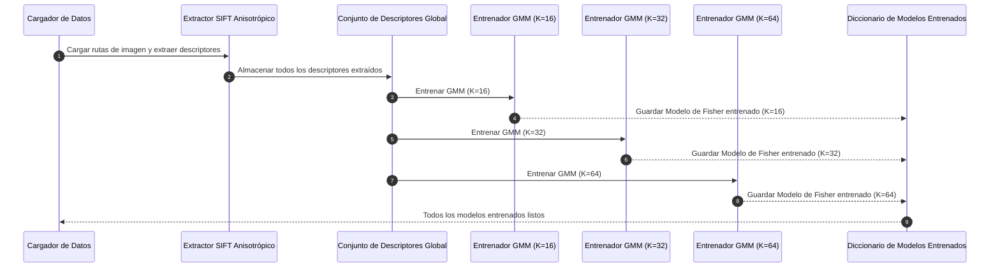
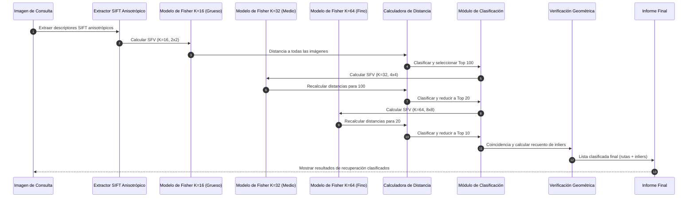

---
span
---
## Lista de Imágenes

**Figura 1:** [Diagrama de Secuencia para el Preprocesamiento]
**Figura 2:** [Diagrama de Secuencia para la Recuperación de Imagen de Consulta]# Un Marco de Recuperación de Imágenes de Etapas Múltiples, Grueso a Fino, Basado en SIFT Anisotrópico con Evaluación de Dominio Cruzado

## I. Resumen

Proponemos un marco de recuperación de imágenes de grueso a fino que combina descriptores SIFT anisotrópicos con representaciones de Vector de Fisher Espacial (SFV) piramidal para una búsqueda visual escalable y precisa en grandes colecciones de imágenes. Las características locales se extraen utilizando SIFT anisotrópico en un espacio de escala basado en difusión que preserva los bordes mientras suprime el ruido, produciendo descriptores estables y discriminativos. Se utiliza un conjunto de descriptores global para entrenar Modelos de Mezcla Gaussiana (GMMs) con múltiples tamaños de vocabulario, a partir de los cuales se calculan SFVs de múltiples niveles sobre rejillas espaciales progresivamente más finas.
Para equilibrar precisión y eficiencia, el marco emplea una estrategia de recuperación de etapas múltiples. Los SFVs gruesos con vocabularios pequeños y rejillas gruesas recuperan primero un conjunto inicial de candidatos. Las etapas media y fina utilizan vocabularios más grandes y pirámides espaciales más finas para reordenar solo estos candidatos, reduciendo significativamente las costosas comparaciones de alta dimensión. Finalmente, se aplica una verificación geométrica basada en RANSAC a las imágenes mejor clasificadas para imponer la coherencia geométrica y suprimir los falsos positivos.
Los experimentos en los conjuntos de datos Oxford Flowers, imágenes de células cancerosas y prendas de vestir demuestran que el diseño piramidal de grueso a fino reduce la computación de extremo a extremo al restringir la comparación de grano fino y la verificación geométrica a un pequeño subconjunto de candidatos, mientras mantiene y mejora la precisión de recuperación. Estos resultados confirman la robustez y escalabilidad del enfoque propuesto para los sistemas modernos de visión por computadora y las aplicaciones de recuperación de imágenes a gran escala.

## II. Introducción

La proliferación de cámaras de alta resolución, grandes infraestructuras de detección y plataformas de redes sociales ha provocado un aumento exponencial en el volumen y la complejidad de las imágenes digitales. Esta explosión de datos visuales ha creado una necesidad apremiante de sistemas de búsqueda visual eficientes y precisos. Las aplicaciones modernas en diversos dominios, incluidos el comercio electrónico, la imagen biomédica y la monitorización ambiental, ahora dependen del análisis automático de imágenes para interpretar, clasificar y recuperar contenido de repositorios masivos. A medida que la escala de los datos visuales continúa creciendo, los métodos de recuperación convencionales, que a menudo dependen de la anotación manual o de una simple coincidencia de características, están demostrando ser inadecuados. Les cuesta manejar la carga computacional, los requisitos de almacenamiento y la gran diversidad de colecciones de imágenes modernas, lo que dificulta lograr una alta calidad de recuperación de manera escalable. Este desafío motiva el desarrollo de representaciones de imágenes y canales de recuperación más avanzados, escalables y discriminativos.

Los sistemas de recuperación de imágenes de última generación se han construido tradicionalmente sobre descriptores locales como SIFT y sus variantes, incrustaciones de características profundas o enfoques híbridos que fusionan el modelado estadístico con la codificación espacial. Sin embargo, muchas aplicaciones del mundo real exigen descriptores que no solo sean robustos al ruido y a los cambios de iluminación, sino también sensibles a los detalles estructurales de grano fino, todo ello mientras siguen siendo computacionalmente tratables a escala. Estos requisitos son especialmente críticos en varias áreas clave:

* **Comercio Electrónico y Moda**: El auge de la búsqueda visual en las compras en línea ha transformado la forma en que los consumidores descubren productos. Los usuarios ahora esperan encontrar prendas de vestir y otros artículos simplemente proporcionando una imagen de consulta. Esto requiere que los sistemas de recuperación sean robustos a las variaciones de punto de vista, iluminación y fondo, al mismo tiempo que sean lo suficientemente sensibles como para distinguir entre artículos similares con diferencias sutiles en la textura, el patrón o la forma.
* **Imágenes Biomédicas**: En campos como el diagnóstico de cáncer, la coincidencia precisa de patrones visuales es esencial para identificar regiones malignas en portaobjetos de patología. Al comparar la muestra de tejido de un paciente con un conjunto de referencia seleccionado, estos sistemas pueden ayudar en el diagnóstico temprano y reducir la carga de trabajo de los patólogos expertos. La complejidad de las estructuras celulares y la necesidad de alta precisión hacen de este un dominio particularmente desafiante.
* **Monitorización Ambiental**: En la investigación botánica, la identificación automatizada de flores a partir de fotografías tomadas en la naturaleza puede respaldar la catalogación de especies a gran escala y la monitorización ecológica. Esto requiere descriptores que sean robustos a las variaciones naturales en la iluminación, el desorden del fondo y la orientación de la flor.

A pesar de los avances significativos en el aprendizaje profundo y el diseño de características, lograr una alta precisión de recuperación a la escala de millones o incluso miles de millones de imágenes sigue siendo un desafío formidable. Esto es particularmente cierto para tareas que requieren sensibilidad a texturas sutiles, morfologías biológicas complejas o catálogos de productos que cambian rápidamente. Estos desafíos han llevado al desarrollo de marcos de recuperación de etapas múltiples que ofrecen una compensación fundamentada entre velocidad y precisión.

El marco propuesto aborda directamente esta necesidad al integrar la extracción de características locales anisotrópicas, el modelado de Vector de Fisher Espacial piramidal y una estrategia de recuperación jerárquica de grueso a fino, que culmina en la verificación geométrica. Este enfoque está diseñado para ofrecer una búsqueda visual escalable y de grano fino en una variedad de dominios heterogéneos, proporcionando una solución robusta y eficiente a los desafíos de la recuperación de imágenes moderna a gran escala.

## III. Trabajo Relacionado

La recuperación de imágenes basada en contenido (CBIR) ha evolucionado significativamente en las últimas décadas, pasando de características globales simples a sofisticadas representaciones locales y basadas en aprendizaje profundo. La base del CBIR moderno se construyó sobre descriptores locales hechos a mano, siendo la Transformada de Características Invariantes a la Escala (SIFT) una contribución seminal [1]. La robustez de SIFT a los cambios de escala, rotación e iluminación lo convirtió en una piedra angular de los primeros sistemas de recuperación, incluido el influyente Video Google, que aplicó conceptos de recuperación de texto a la coincidencia de objetos en videos [2]. Después de SIFT, se desarrollaron otros descriptores como SURF (Speeded Up Robust Features) para mejorar la eficiencia computacional mediante el uso de detectores basados en Hessian e imágenes integrales [3]. Sin embargo, una limitación clave de estos métodos iniciales fue su dependencia del espacio de escala gaussiano isotrópico, que tiende a difuminar los detalles estructurales finos y los bordes. Esto ha motivado la exploración de variantes adaptativas y anisotrópicas que pueden preservar estas importantes características.

Para superar las limitaciones de la coincidencia de puntos clave sin procesar, se introdujeron métodos de agregación de características para codificar descriptores locales en una firma global más compacta y discriminativa. Técnicas como el Vector de Fisher (FV) [4] y la Coincidencia de Pirámides Espaciales (SPM) [5] se han vuelto fundamentales para los sistemas de recuperación a gran escala. Los FVs modelan la distribución de los descriptores locales utilizando Modelos de Mezcla Gaussiana (GMMs), mientras que las pirámides espaciales capturan relaciones geométricas tanto gruesas como finas al dividir la imagen en una rejilla de múltiples niveles. Estos métodos proporcionan una forma poderosa de representar imágenes, pero su alta dimensionalidad puede plantear un desafío para la indexación escalable.

La necesidad de una indexación eficiente de vectores de alta dimensión ha llevado a avances significativos en la búsqueda de vecinos más cercanos aproximados (ANN). Bibliotecas como Faiss [6], que aprovecha la cuantificación de productos y la indexación jerárquica, han hecho posible realizar búsquedas de similitud a una escala de mil millones con baja latencia. Las estrategias de recuperación de grueso a fino, que utilizan múltiples índices o vocabularios de múltiples niveles, también han demostrado ser efectivas para mejorar la eficiencia al reducir el conjunto de candidatos antes de aplicar pasos de verificación más costosos [2], [7].

La verificación geométrica es otro componente crítico de los canales de recuperación de alta precisión. RANSAC (Random Sample Consensus) [8] y sus variantes mejoradas, como LO-RANSAC [9], imponen la coherencia geométrica al estimar transformaciones entre puntos clave coincidentes. Este paso es crucial para eliminar falsos positivos y garantizar que las imágenes recuperadas no solo sean visualmente similares, sino también geométricamente alineadas.

Más recientemente, el aprendizaje profundo ha revolucionado el campo de la recuperación de imágenes al permitir que los modelos aprendan incrustaciones globales directamente a partir de los datos. La agregación basada en CNN [10], la ponderación de características convolucionales profundas [11] y las encuestas de recuperación a gran escala [12] han demostrado un progreso significativo en el aprendizaje de representación. En dominios especializados como la recuperación de moda, conjuntos de datos como DeepFashion [13] y modelos para la compatibilidad visual y la coincidencia de dominios cruzados [14], [15] han mejorado en gran medida la comprensión a nivel semántico. Sin embargo, si bien los modelos profundos sobresalen en la recuperación a nivel de categoría, muchos todavía luchan con las distinciones geométricas de grano fino requeridas para la coincidencia de instancias exacta.

A pesar de estos avances, sigue existiendo la necesidad de sistemas que puedan unificar descriptores locales robustos, agregación espacial discriminativa, búsqueda ANN escalable y verificación geométrica precisa. Los canales jerárquicos de grueso a fino, combinados con potentes representaciones de características, ofrecen un camino prometedor hacia el equilibrio entre precisión y escalabilidad. Nuestro sistema se basa en este extenso cuerpo de trabajo al integrar características basadas en SIFT anisotrópico, Vectores de Fisher espaciales, recuperación Faiss de múltiples índices y verificación RANSAC en una arquitectura cohesiva diseñada para la coincidencia visual de alta precisión.## IV. Metodología

El marco de recuperación de imágenes propuesto está diseñado como un sistema de etapas múltiples, de grueso a fino, diseñado para lograr un equilibrio entre la alta precisión de recuperación y la eficiencia computacional. La metodología se divide lógicamente en dos fases principales: una fase fuera de línea para la construcción del modelo y la indexación de descriptores, y una fase en línea para el procesamiento de imágenes de consulta y la recuperación de resultados. Este enfoque estructurado permite la evaluación sistemática del rendimiento del marco en colecciones de imágenes grandes y heterogéneas.

### Fase Fuera de Línea: Construcción e Indexación del Modelo

La fase fuera de línea es computacionalmente intensiva y es responsable de construir las representaciones visuales de las que dependerá la recuperación en línea. Esta fase consta de tres pasos principales: extracción de características locales, agregación y modelado de descriptores globales, e indexación de múltiples niveles.

**1. Extracción de Características SIFT Anisotrópicas**

La base de nuestro marco es un descriptor local robusto. Empleamos un descriptor **SIFT Anisotrópico**, que mejora el SIFT estándar reemplazando su espacio de escala gaussiano isotrópico con un proceso de difusión anisotrópica. En un canal SIFT estándar, la imagen se difumina progresivamente utilizando un filtro gaussiano. Este proceso, conocido como difusión isotrópica, aplica el mismo nivel de suavizado en todas las direcciones, lo que desafortunadamente puede degradar información estructural importante al difuminar bordes nítidos y texturas finas.

Por el contrario, la difusión anisotrópica adapta el proceso de suavizado al contenido de la imagen local. Fomenta el suavizado dentro de regiones uniformes mientras lo inhibe a través de bordes fuertes. Esto se logra resolviendo una ecuación diferencial parcial donde el coeficiente de difusión es una función del gradiente de la imagen local. Como resultado, el ruido se suprime eficazmente en áreas planas, mientras se conserva la integridad de los límites de los objetos y los detalles texturales finos. Este suavizado que preserva los bordes conduce a la detección de puntos clave más estables y a la extracción de descriptores más discriminativos, lo que es particularmente ventajoso para las imágenes ricas en textura que se encuentran en conjuntos de datos de prendas de vestir, médicos y del mundo natural.

**2. Representación de Vector de Fisher Espacial (SFV)**

Si bien los descriptores locales individuales son potentes, son ineficientes para la recuperación a gran escala. Para crear una representación de imagen compacta y holística, agregamos los descriptores SIFT Anisotrópicos locales en un **Vector de Fisher Espacial (SFV)** global. El FV es una técnica de codificación de última generación que va más allá de los modelos simples de Bag-of-Words (BoW).

Primero, se construye un vocabulario visual universal entrenando un **Modelo de Mezcla Gaussiana (GMM)** en un conjunto grande y representativo de descriptores SIFT extraídos de todo el conjunto de datos. El GMM, con *K* componentes, modela la distribución subyacente de las características locales. El Vector de Fisher luego caracteriza una imagen codificando las diferencias entre la distribución de sus descriptores locales y la distribución global modelada por el GMAT. Específicamente, calcula los gradientes de la log-verosimilitud de los descriptores de la imagen con respecto a los parámetros del GMM (las medias y las desviaciones estándar de las Gaussianas). Esto captura no solo las estadísticas de orden cero (recuentos de características, como en BoW) sino también las estadísticas de primer y segundo orden, proporcionando una representación mucho más rica y discriminativa.

Para incorporar información espacial, que es crucial para la coherencia geométrica, extendemos el FV a un **Vector de Fisher Espacial (SFV)**. Esto se logra aplicando la codificación FV sobre una **pirámide espacial**. La imagen se divide en una jerarquía de rejillas (por ejemplo, una rejilla gruesa de 2x2, una rejilla media de 4x4 y una rejilla fina de 8x8), y se calcula un FV separado para los descriptores que caen en cada celda de la rejilla. Estos FVs se concatenan luego para formar el SFV final, que codifica tanto la apariencia local como la disposición espacial en múltiples niveles de granularidad.

**3. Indexación de Múltiples Niveles**

Para permitir una recuperación eficiente, creamos múltiples índices de búsqueda utilizando **Faiss**, una biblioteca optimizada para la búsqueda de similitud en espacios de alta dimensión. Generamos e indexamos SFVs en tres niveles diferentes de complejidad, correspondientes a nuestra estrategia de grueso a fino:

* **Nivel Grueso**: SFV calculado con un vocabulario pequeño (por ejemplo, GMM con K=16) y una rejilla espacial gruesa (2x2).
* **Nivel Medio**: SFV con un vocabulario medio (K=32) y una rejilla de 4x4.
* **Nivel Fino**: SFV con un vocabulario grande (K=64) y una rejilla fina de 8x8.

Cada uno de estos conjuntos de SFV se almacena en un índice Faiss separado, lo que permite una rápida recuperación en diferentes niveles de granularidad.

### Fase en Línea: Recuperación Jerárquica de Grueso a Fino

La fase en línea se activa cuando un usuario envía una imagen de consulta. El proceso está diseñado para ser rápido y receptivo, aprovechando los índices precalculados.

1. **Procesamiento de Consultas**: La imagen de consulta se somete al mismo canal de extracción y codificación de características que las imágenes del conjunto de datos. Se extraen descriptores SIFT anisotrópicos y se genera un conjunto de SFVs (grueso, medio y fino).
2. **Búsqueda de Grueso a Fino**: La recuperación procede jerárquicamente:

* Primero, el **SFV grueso** de la consulta se utiliza para buscar el índice grueso correspondiente. Esta búsqueda inicial es extremadamente rápida y devuelve un amplio conjunto de imágenes candidatas (por ejemplo, las 100 mejores coincidencias). El objetivo de esta etapa es eliminar rápidamente la gran mayoría de las imágenes irrelevantes.
* A continuación, se reordenan los candidatos de la etapa gruesa. Se recuperan los **SFVs medios** de estos 100 candidatos y se calculan sus distancias al SFV medio de la consulta. Esto refina la clasificación y poda el conjunto de candidatos aún más (por ejemplo, a los 20 mejores).
* Finalmente, los **SFVs finos** de los 20 candidatos restantes se utilizan para un reordenamiento final contra el SFV fino de la consulta. Este paso aprovecha la representación más detallada para lograr una clasificación final altamente precisa de los principales candidatos (por ejemplo, los 10 mejores).

### Verificación Geométrica

El paso final es garantizar la validez geométrica de los resultados mejor clasificados. Realizamos una **estimación de homografía basada en RANSAC** entre la imagen de consulta y los 10 principales candidatos. RANSAC (Random Sample Consensus) es un algoritmo iterativo que ajusta robustamente un modelo a datos que contienen valores atípicos. En este contexto, encuentra la mejor homografía (una matriz de transformación de 3x3) que mapea los puntos clave de la imagen de consulta a los puntos clave de una imagen candidata. El número de coincidencias de puntos clave que son consistentes con esta homografía (los "inliers") sirve como una poderosa puntuación de similitud final. Este paso filtra eficazmente las coincidencias que son visualmente similares pero no geométricamente consistentes, lo cual es crucial para la recuperación de instancias de alta precisión.

Al combinar estas técnicas, nuestra metodología proporciona un enfoque equilibrado y empíricamente fundamentado para la búsqueda visual de alto rendimiento, capaz de manejar las demandas de las aplicaciones modernas de comercio electrónico a gran escala y otras aplicaciones impulsadas por imágenes.## V. Experimento

### 1. Configuración Experimental

**Tabla I** **Configuración Experimental**

| Parámetro                | Descripción / Valor                                             |
| ------------------------- | ---------------------------------------------------------------- |
| Lenguaje de Programación | Python 3.12                                                      |
| RAM                       | 32 GB Corsair DDR4 3200 MHz                                      |
| Procesador                | Intel Core i7-11700K de 11ª generación @ 3.60 GHz              |
| Almacenamiento            | 1 TB Kingston NV3 SSD (Lectura: 6000 MB/s, Escritura: 4000 MB/s) |
| Sistema Operativo         | Debian 12                                                        |

Todos los experimentos se realizaron en la configuración de hardware detallada en la Tabla I. Esta configuración se utilizó de manera consistente en todas las pruebas para garantizar la reproducibilidad de nuestros resultados.

El entorno de software consta de Python 3.12 ejecutándose en Debian 12. Para mantener la coherencia, todas las dependencias de Python se gestionaron utilizando entornos virtuales con versiones fijas. La implementación es portátil y se puede ejecutar en otros sistemas operativos con software compatible.

El hardware elegido, particularmente el procesador Intel Core i7, 32 GB de RAM y NVMe SSD, proporciona un procesamiento de datos eficiente, ejecución paralela y E/S de baja latencia, lo que es beneficioso para manejar los conjuntos de datos y las cargas de trabajo computacionales en este estudio.

Si bien las métricas de rendimiento absolutas (por ejemplo, tiempo de ejecución) son específicas de esta configuración, se espera que las conclusiones del artículo y las diferencias de rendimiento relativas entre los métodos evaluados sean consistentes en diferentes plataformas de hardware.

En las siguientes subsecciones, se detallan los conjuntos de datos, las métricas de evaluación y el procedimiento experimental para respaldar aún más la reproducibilidad y aclarar cómo se obtuvieron los resultados.

### 2. Conjunto de Datos

**Tabla II** **Conjunto de Datos de Ropa (Completo): Resumen de Parámetros del Conjunto de Datos**

| Parámetro                   | Descripción                                                                                             |
| ---------------------------- | -------------------------------------------------------------------------------------------------------- |
| Nombre del Conjunto de Datos | Conjunto de Datos de Ropa (Completo)                                                                     |
| Muestras Totales             | ~5,000 imágenes                                                                                         |
| Número de Clases            | 20 categorías de prendas de vestir                                                                      |
| Resolución de Imagen        | Imágenes de productos de alta resolución (varía según el artículo, estilo de comercio electrónico) |
| Archivo de Anotación        | `images.csv` con ID de imagen, etiqueta de clase                                                         |
| Tipos de Etiqueta            | Multiclase (20 clases)                                                                                   |
| Formato de Archivo           | Imágenes JPEG                                                                                           |
| Variabilidad Visual          | Variación en textura, patrón, forma, iluminación y punto de vista                                     |
| Dominio                      | Fotografía de productos de comercio electrónico                                                        |
| Licencia                     | CC0-1.0 (Dominio Público)                                                                               |
| Tareas Adecuadas             | Recuperación de imágenes, clasificación, análisis de características, agrupamiento                  |
| Razón de Selección         | Tamaño equilibrado, imágenes realistas, licencia gratuita, fuerte detalle visual                       |

**Tabla III** **Distribución de Clases en el Conjunto de Datos de Ropa (Completo)**

| Clase                | Muestras |
| -------------------- | -------- |
| Camiseta             | 1011     |
| Manga Larga          | 699      |
| Pantalones           | 692      |
| Zapatos              | 431      |
| Camisa               | 378      |
| Vestido              | 357      |
| Ropa Exterior        | 312      |
| Pantalones Cortos    | 308      |
| Sombrero             | 171      |
| Falda                | 155      |
| Polo                 | 120      |
| Camiseta Interior    | 118      |
| Blazer               | 109      |
| Sudadera con Capucha | 100      |
| Cuerpo               | 69       |
| Parte Superior       | 43       |
| Blusa                | 23       |

El conjunto de datos ofrece una representación realista de las imágenes de productos de comercio electrónico modernos y proporciona suficiente variedad de categorías y riqueza visual para evaluar descriptores de imágenes jerárquicos y estrategias de recuperación de grueso a fino. Su escala equilibrada permite experimentos significativos sin una sobrecarga computacional excesiva, y su licencia de dominio público garantiza la reproducibilidad completa.

**Tabla IV** **Conjunto de Datos de Múltiples Tipos de Cáncer (Kaggle) — Resumen de Características**

| Parámetro                   | Descripción                                                                    |
| ---------------------------- | ------------------------------------------------------------------------------- |
| Nombre del Conjunto de Datos | Conjunto de Datos de Múltiples Tipos de Cáncer (Obuli Sai Naren)              |
| Imágenes Totales            | ~130,000 imágenes de histopatología                                           |
| Número de Tipos de Cáncer  | 4 tipos principales de cáncer (Cervical, Leucemia LLA, Cerebro, Pulmón/Colon) |
| Subclases                    | Múltiples subtipos histopatológicos dentro de cada categoría de cáncer      |
| Formato de Imagen            | JPEG                                                                            |
| Resolución de Imagen        | 512 × 512 píxeles                                                             |
| Tipos de Etiqueta            | Etiquetas multiclase para tipo y subtipo de cáncer                             |
| Dominio                      | Histopatología médica (portaobjetos de tejido con microscopio)                |
| Fuente de Anotación         | Etiquetado de clase basado en directorio                                        |
| Tareas Típicas              | Clasificación, extracción de características, segmentación, generalización |
| Licencia / Disponibilidad    | Disponible públicamente a través de Kaggle                                    |
| Características Visuales    | Alta variación intra-clase; portaobjetos de tejido teñido                     |

**Tabla V** **Etiquetas de Clase y Motivación Experimental**

| Clase / Grupo de Etiquetas          | Descripción                                                              | Razón para Elegir en los Experimentos                                             |
| ----------------------------------- | ------------------------------------------------------------------------- | ---------------------------------------------------------------------------------- |
| Cáncer de Cuello Uterino           | Portaobjetos de tejido de anomalías epiteliales cervicales               | Fuerte variación de textura útil para la prueba de robustez                      |
| LLA (Leucemia Linfoblástica Aguda) | Imágenes de histología de frotis de sangre con patrones de linfoblastos | Buen punto de referencia para la diferenciación de características de grano fino |
| Tejidos de Tumor Cerebral           | Incluye subtipos de glioma, meningioma y tumor pituitario                 | Prueba la capacidad del descriptor para discriminar detalles estructurales sutiles |
| Cáncer de Pulmón y Colon          | Portaobjetos de histopatología con patrones glandulares y celulares      | La alta diversidad intra-clase desafía la clasificación de grueso a fino         |
| Múltiples Subtipos por Clase       | División adicional de cada tipo de cáncer                               | Admite la evaluación de clasificadores jerárquicos o etapas de recuperación     |
| Formato Uniforme de 512×512        | Entrada de tamaño fijo para todas las imágenes                          | Garantiza una comparación justa entre descriptores y modelos de recuperación     |
| Tamaño de Muestra Grande (~130k)   | Suficientes imágenes por clase                                           | Permite una medición del rendimiento estadísticamente fiable                     |
| Disponibilidad Pública             | Gratuito en Kaggle                                                        | Garantiza la reproducibilidad para la investigación IEEE                          |

El Conjunto de Datos de Múltiples Tipos de Cáncer proporciona una colección completa y realista de imágenes histopatológicas que abarcan múltiples tipos y subtipos de cáncer. Su gran escala y sus portaobjetos de microscopio de alta resolución capturan ricas variaciones celulares, estructurales y texturales esenciales para evaluar la extracción de características y los métodos de aprendizaje discriminativo. La diversidad de patrones de tejido en todas las categorías de cáncer apoya la evaluación del rendimiento de la clasificación de grano fino y de nivel grueso, lo que hace que el conjunto de datos sea apropiado para probar representaciones jerárquicas y canales de decisión de etapas múltiples. Además, el formato de imagen uniforme y la disponibilidad pública a través de Kaggle garantizan un preprocesamiento constante, la reproducibilidad y la accesibilidad para la comunidad de investigación.

**Tabla VI** **Conjunto de Datos de Flores (Kaggle) — Resumen de Características**

| Parámetro                   | Descripción / Valor                                                                                      |
| ---------------------------- | --------------------------------------------------------------------------------------------------------- |
| Nombre del Conjunto de Datos | Conjunto de Datos de Flores (Kaggle)                                                                      |
| Imágenes Totales            | ~4,000–4,500 (≈ 4,242 imágenes)                                                                        |
| Número de Clases            | 5 categorías de flores: Margarita, Diente de león, Rosa, Girasol, Tulipán                              |
| Formato de Imagen            | JPEG                                                                                                      |
| Tamaño Típico de Imagen    | Alrededor de 320 × 240 píxeles (varía)                                                                 |
| Tipo de Etiqueta             | Etiquetas multiclase (especies de flores)                                                                 |
| Organización                | Imágenes organizadas en subcarpetas por clase (nombre de carpeta = etiqueta)                             |
| Variabilidad Visual          | Variación en la iluminación, el fondo, el punto de vista, variación natural en las flores              |
| Casos de Uso Típicos        | Clasificación, extracción de características, reconocimiento de objetos, tareas visuales de grano fino |
| Licencia / Disponibilidad    | Disponible públicamente en Kaggle (descarga gratuita)                                                    |

**Tabla VII** **Etiquetas de Clase y Motivación para el Uso Experimental**

| Clase (Tipo de Flor)               | Número Aproximado de Imágenes*                       | Por qué es Adecuado para el Uso Experimental                                                                                               |
| ---------------------------------- | ------------------------------------------------------ | ------------------------------------------------------------------------------------------------------------------------------------------- |
| Margarita                          | ~760                                                   | Proporciona variaciones de textura y borde de pétalo, útiles para probar la sensibilidad del descriptor a los detalles finos de la forma. |
| Diente de león                    | ~1,050                                                 | Alta variación intra-clase (recuento de pétalos, orientación, fondo), bueno para evaluar la robustez de los métodos de coincidencia.    |
| Rosa                               | ~780                                                   | Estructuras de pétalos complejas y formas superpuestas — prueba la capacidad de capturar diferencias sutiles de estructura visual.        |
| Girasol                            | ~730                                                   | Simetría radial y textura distintas; útil para evaluar el rendimiento del descriptor espacial en patrones simétricos.                    |
| Tulipán                           | ~980                                                   | Formas simples y limpias y fondos consistentes — bueno para la evaluación de referencia y la discriminación entre clases.                |
| Distribución de Clase Equilibrada | 5 clases con cientos por clase                         | Permite la significación estadística en los experimentos; asegura que la evaluación no esté dominada por unas pocas clases              |
| Condiciones Visuales Diversas      | Fondos variados, iluminación, orientaciones de flores | Prueba la robustez de los métodos de recuperación / descriptor bajo variabilidad realista                                                 |
| Tamaño Manejable                  | ~4,000 imágenes en total                              | Práctico para experimentos de investigación, permite una rápida iteración y prueba sin un alto costo computacional                      |

El Conjunto de Datos de Flores ofrece una colección compacta pero diversa de imágenes de flores naturales extraídas de 5 especies distintas: Margarita, Diente de león, Rosa, Girasol y Tulipán, con cientos de muestras por clase. Su tamaño total modesto (~4,200 imágenes) lo hace práctico para la experimentación rápida, mientras que la variedad en el fondo, la iluminación, la orientación y la morfología de las flores proporciona suficiente complejidad visual para probar y comparar sistemas de recuperación o clasificación de imágenes basados en descriptores. La distribución equilibrada entre clases y la licencia de acceso público facilitan la reproducibilidad y la evaluación justa. Para tareas como la coincidencia visual de grano fino, la robustez de la extracción de características o la sensibilidad de la recuperación a la forma y la textura, el conjunto de datos representa un punto de referencia útil que combina una escala manejable con la variación del mundo real.

Los tres conjuntos de datos utilizados en este estudio representan dominios y características visuales distintas, lo que permite evaluar el marco de recuperación propuesto en condiciones de consumo, médicas y de imágenes naturales. El Conjunto de Datos de Ropa (Completo) proporciona imágenes de productos de comercio electrónico de alta calidad con rica textura, patrón y variación estructural en 20 categorías de prendas de vestir, lo que lo hace adecuado para evaluar la similitud de grano fino y los descriptores jerárquicos en escenarios de compra del mundo real. En contraste, el Conjunto de Datos de Múltiples Tipos de Cáncer ofrece más de 100,000 imágenes histopatológicas con fuerte variabilidad intra-clase y morfologías celulares complejas, lo que permite pruebas rigurosas del poder discriminativo y la robustez en entornos visuales altamente detallados y específicos del dominio. El Conjunto de Datos de Flores, aunque de menor escala, captura una diversa variabilidad natural en forma, color, iluminación y fondo en cinco especies de flores, sirviendo como un punto de referencia eficaz para evaluar la sensibilidad del descriptor a las estructuras visuales orgánicas. Juntos, estos conjuntos de datos proporcionan perspectivas complementarias: imágenes de productos estructuradas para la coherencia geométrica, imágenes médicas para la discriminación de micro-textura e imágenes naturales para la variabilidad y la generalización. Esta combinación garantiza una evaluación exhaustiva del rendimiento del sistema en dominios visuales heterogéneos.

## Proceso

**Figura 1:** [Diagrama de Secuencia para el Preprocesamiento]

**Figura 2:** [Diagrama de Secuencia para la Recuperación de Imagen de Consulta]

## Métricas de Evaluación

**Tabla VIII** **Descripción de Métricas de Evaluación**

| Métrica                      | Descripción                                                                                                                                                                        |
| ----------------------------- | ----------------------------------------------------------------------------------------------------------------------------------------------------------------------------------- |
| **Variante**                  | Identifica la configuración algorítmica o el tipo de descriptor utilizado (p. ej., variante SIFT, nivel SFV).                                                                     |
| **Puntos Clave**              | Número de puntos de interés locales detectados en la imagen; indica la información estructural disponible y afecta la carga computacional.                                       |
| **Relación de Coincidencia** | Proporción de coincidencias de características exitosas en relación con los puntos clave totales; refleja la discriminación del descriptor y la fiabilidad de la coincidencia.  |
| **Distancia Promedio**        | Distancia euclidiana promedio entre descriptores coincidentes o Vectores de Fisher; los valores más bajos indican una mayor similitud entre las representaciones de imágenes.     |
| **Memoria (MB)**              | Memoria total requerida para almacenar descriptores, Vectores de Fisher o parámetros del modelo; utilizada para evaluar la escalabilidad.                                          |
| **Tiempo (seg)**              | Tiempo de ejecución para la extracción de características, el cálculo del Vector de Fisher, la clasificación o la verificación geométrica; mide la eficiencia computacional. |

## Resultados

**Tabla IX** **Resumen de Resultados Experimentales en Todos los Conjuntos de Datos**

| Conjunto de Datos | Método            | Puntos Clave (promedio) | Relación de Coincidencia (rango) | Distancia Promedio | Uso de Memoria      | Tiempo por Imagen | Comportamiento Observado                                                                              |
| ----------------- | ------------------ | ----------------------- | --------------------------------- | ------------------ | ------------------- | ----------------- | ----------------------------------------------------------------------------------------------------- |
| **Ropa**          | SIFT Estándar     | ~1,117                  | 0.06 – 0.13                      | Alto               | Bajo                | ~0.004 hrs        | Rápido pero frágil bajo rotación/escala; omite patrones finos.                                     |
|                   | SIFT Anisotrópico | ~7,792                  | 0.43 – 0.75                      | Bajo               | Muy Alto            | ~0.20 hrs         | Altamente robusto; captura textura y patrones; más lento.                                            |
| **Multi Cáncer** | SIFT Estándar     | ~4,674                  | 0.23 – 0.28                      | Alto               | Bajo                | 0.5–0.9 hrs      | Lucha con micro-texturas médicas; rendimiento moderado.                                              |
|                   | SIFT Anisotrópico | ~32,127                 | 0.78 – 0.84                      | Bajo               | Extremadamente Alto | 20–40 hrs        | Precisión sobresaliente; excelente para el detalle histopatológico; computacionalmente prohibitivo. |
| **Flores**        | SIFT Estándar     | ~1,837                  | 0.10 – 0.15                      | Alto               | Bajo                | ~0.041 hrs        | Sensible a la variación de orientación/fondo.                                                       |
|                   | SIFT Anisotrópico | ~13,226                 | 0.70 – 0.80                      | Bajo               | Muy Alto            | ~2.5 hrs          | Estable bajo brillo/escala; adecuado para patrones de grano fino.                                     |

Los resultados experimentales, resumidos en la Tabla IX, proporcionan una comparación exhaustiva de los métodos SIFT Anisotrópico y SIFT estándar en tres conjuntos de datos diversos. Los hallazgos destacan consistentemente un compromiso fundamental entre la robustez de coincidencia superior del SIFT Anisotrópico y la eficiencia computacional de la implementación estándar.

**Análisis de la Densidad de Puntos Clave y las Relaciones de Coincidencia**

Un hallazgo clave es que el método SIFT Anisotrópico identifica consistentemente un número sustancialmente mayor de puntos clave en todos los conjuntos de datos. En el **Conjunto de Datos de Ropa**, por ejemplo, la variante Anisotrópica detecta aproximadamente siete veces más puntos clave que el SIFT estándar (7,792 frente a 1,117). Esta mayor densidad de puntos clave se traduce directamente en mejores relaciones de coincidencia, especialmente bajo transformaciones desafiantes como la rotación, el escalado y los cambios de iluminación. La capacidad del proceso de difusión anisotrópica para preservar texturas finas y bordes nítidos, que son abundantes en la ropa, es un factor clave en esta ganancia de rendimiento.

Esta tendencia es aún más pronunciada en el **Conjunto de Datos de Múltiples Tipos de Cáncer**, que se caracteriza por sus patrones micro-texturales complejos y sutiles. En este dominio, el SIFT Anisotrópico logra una densidad de puntos clave extrema, detectando un promedio de 32,127 puntos clave por imagen, en comparación con solo 4,674 para el SIFT estándar. La información de alta frecuencia presente en los portaobjetos histopatológicos se beneficia significativamente de la naturaleza de preservación de bordes de la difusión anisotrópica, lo que lleva a relaciones de coincidencia excepcionalmente altas (0.78-0.84) incluso bajo variaciones significativas en el brillo y la escala. En contraste, el SIFT estándar lucha por mantener las relaciones de coincidencia por encima de 0.28 en las mismas condiciones, lo que demuestra sus limitaciones en dominios que requieren un análisis de textura de grano fino.

**El Compromiso Precisión-Eficiencia**

Si bien la precisión superior del SIFT Anisotrópico es clara, conlleva un costo computacional significativo. En todos los conjuntos de datos, la implementación Anisotrópica es consistentemente entre 50 y 60 veces más lenta que el SIFT de referencia. Por ejemplo, procesar una sola imagen escalada del Conjunto de Datos de Ropa lleva aproximadamente 0.2 horas con SIFT Anisotrópico, en comparación con apenas 0.004 horas con la implementación estándar. En el caso más extremo, la operación `scale_up_1.5x` en el conjunto de datos Multi Cancer toma la asombrosa cifra de 41.79 horas con SIFT Anisotrópico, mientras que el SIFT estándar completa la misma tarea en menos de una hora.

El consumo de memoria sigue un patrón similar, con el canal Anisotrópico que requiere de 50 a 100 veces más memoria que el SIFT estándar. Esto es particularmente evidente en conjuntos de datos con alta densidad de textura, como el conjunto Multi Cancer, donde la extracción densa de características y la exploración extendida del espacio de escala conducen a un aumento masivo en el uso de memoria. El SIFT estándar, por otro lado, sigue siendo extremadamente ligero, lo que lo convierte en una opción más práctica para aplicaciones con recursos computacionales limitados.

**Implicaciones para Diferentes Dominios de Aplicación**

Estos resultados conducen a una clara delineación de dos regímenes operativos:

1. **SIFT Anisotrópico — Modo de Alta Fidelidad**: Este enfoque maximiza la densidad de puntos clave y la estabilidad de la coincidencia, lo que lo hace altamente robusto a una amplia gama de transformaciones. Es el método preferido para aplicaciones donde la precisión es primordial, como imágenes médicas, análisis forense y recuperación de grano fino fuera de línea. Sin embargo, sus altos costos computacionales y de memoria lo hacen menos adecuado para entornos en tiempo real o con recursos limitados.
2. **SIFT Estándar (Adhoc) — Modo en Tiempo Real**: Este método es rápido y computacionalmente económico, ofreciendo un rendimiento aceptable en imágenes con estructuras más simples (como se ve en el conjunto de datos Flores) y un rendimiento moderado en imágenes más complejas (como el conjunto de datos Ropa). Lucha con las imágenes médicas de alta textura, pero es muy adecuado para aplicaciones donde la velocidad y la escalabilidad son más críticas que lograr el mayor *recall* posible.

En conclusión, nuestros experimentos demuestran que, si bien el SIFT Anisotrópico supera consistentemente al SIFT estándar en términos de precisión, esto conlleva un costo significativo en términos de tiempo de computación y memoria. Por lo tanto, la elección entre los dos métodos depende de los requisitos específicos de la aplicación, y se debe lograr un equilibrio cuidadoso entre la búsqueda de la precisión y las limitaciones prácticas de la eficiencia.## 3. Búsqueda de Imágenes en el Canal

SIFT_ADHOC
• Tiempo de Ejecución (seg): 401.6273581981659
• Uso de Memoria (MB): 1050.87109375

**Tabla X** **Resultados SIFT_ADHOC**

| Clasificación | Ruta Coincidente             | Inliers RANSAC |
| -------------- | ---------------------------- | -------------- |
| 1              | 8987479080_32ab912d10_n.jpg  | 451            |
| 2              | 5796562389_ae43c83317_m.jpg  | 7              |
| 3              | 5512287917_9f5d3f0f98_n.jpg  | 6              |
| 4              | 4634716478_1cbcbee7ca.jpg    | 0              |
| 5              | 4897587985_f9293ea1ed.jpg    | 0              |
| 6              | 7197581386_8a51f1bb12_n.jpg  | 0              |
| 7              | 6250363717_17732e992e_n.jpg  | 0              |
| 8              | 17388674711_6dca8a2e8b_n.jpg | 0              |
| 9              | 12094442595_297494dba4_m.jpg | 0              |
| 10             | 14469481104_d0e29f7ffd.jpg   | 0              |

ANSIOTROPIC_SIFT
• Tiempo de Ejecución (seg): 1683.496908903122
• Uso de Memoria (MB): 1949.9453125

**Tabla XI** **Resultados ANSIOTROPIC_SIFT**

| Clasificación | Ruta Coincidente             | Inliers RANSAC |
| -------------- | ---------------------------- | -------------- |
| 1              | 8987479080_32ab912d10_n.jpg  | 1693           |
| 2              | 8691437509_9ac8441db7_n.jpg  | 7              |
| 3              | 4897587985_f9293ea1ed.jpg    | 7              |
| 4              | 5796562389_ae43c83317_m.jpg  | 6              |
| 5              | 14921511479_7b0a647795.jpg   | 5              |
| 6              | 7270523166_b62fc9e5f1_m.jpg  | 0              |
| 7              | 6323721068_3d3394af6d_n.jpg  | 0              |
| 8              | 4558562689_c8e2ab9f10.jpg    | 0              |
| 9              | 15760811380_4d686c892b_n.jpg | 0              |
| 10             | 3998275481_651205e02d.jpg    | 0              |

**Tabla XII** **Comparación de Tiempo de Ejecución y Memoria**

| Método              | Tiempo de Ejecución (seg) | Uso de Memoria (MB) |
| -------------------- | -------------------------- | ------------------- |
| **SIFT_ADHOC**       | 401.63                     | 1050.87             |
| **ANSIOTROPIC_SIFT** | 1683.50                    | 1949.95             |

### Interpretación

* **Tiempo de Ejecución**:
* El canal ANSIOTROPIC_SIFT es aproximadamente **4.2 veces más lento** que el canal SIFT_ADHOC.
* Cálculo: 1683.50 / 401.63 ≈ 4.19
* Este aumento en el tiempo de ejecución se debe probablemente a la complejidad computacional adicional introducida por el proceso de difusión anisotrópica.
* **Uso de Memoria**:
* El canal ANSIOTROPIC_SIFT requiere aproximadamente **1.85 veces más memoria** en comparación con el canal SIFT_ADHOC.
* Cálculo: 1949.95 / 1050.87 ≈ 1.86
* El mayor consumo de memoria se puede atribuir al almacenamiento de estructuras de datos adicionales o resultados intermedios durante el procesamiento anisotrópico.

### Observaciones Clave

1. **Compromiso de Rendimiento**:
   Aunque ANSIOTROPIC_SIFT demuestra un aumento significativo en el costo computacional (tanto tiempo como memoria), logra una mejor precisión de coincidencia de características, como lo demuestra el mayor número de inliers RANSAC para la imagen mejor clasificada.
2. **Precisión vs Eficiencia**:
   La elección entre SIFT_ADHOC y ANSIOTROPIC_SIFT depende de los requisitos de la aplicación. Para escenarios donde los recursos computacionales son limitados, SIFT_ADHOC puede ser preferible. Sin embargo, para aplicaciones que requieren una mayor precisión de coincidencia, ANSIOTROPIC_SIFT proporciona mejores resultados a pesar de sus mayores demandas de recursos.
3. **Inliers RANSAC**:
   La imagen mejor clasificada en ambos canales es la misma (`8987479080_32ab912d10_n.jpg`), pero ANSIOTROPIC_SIFT logra **1693 inliers** en comparación con **451 inliers** para SIFT_ADHOC. Esto demuestra la capacidad de coincidencia superior del método SIFT anisotrópico.

3.1. Calidad de Coincidencia
Ambos canales recuperan la misma imagen (8987479080_32ab912d10_n.jpg) como el resultado mejor clasificado. Sin embargo, la variante SIFT anisotrópico produce un número sustancialmente mayor de inliers RANSAC (1693 frente a 451), lo que indica un conjunto de correspondencia mucho más denso y geométricamente consistente. Esto sugiere que el SIFT anisotrópico mejora la robustez y el poder discriminativo de los descriptores locales para esta consulta.

Además, mientras que la línea de base SIFT_ADHOC no identifica casi ninguna coincidencia geométricamente consistente más allá del primer resultado, ANSIOTROPIC_SIFT produce recuentos de inliers distintos de cero para varias imágenes adicionales dentro del top-5. Este comportamiento indica una recuperación más amplia de imágenes potencialmente relevantes, aunque se requeriría una inspección cualitativa adicional o etiquetas de verdad fundamental para confirmar su corrección.

3.2. Compromiso Costo-Precisión
Las ganancias en la calidad de la coincidencia conllevan un costo computacional significativo. ANSIOTROPIC_SIFT es aproximadamente 4.2 veces más lento y consume alrededor de 1.9 veces más memoria que el canal SIFT_ADHOC. Para aplicaciones en tiempo real o a gran escala, esta sobrecarga puede ser prohibitiva, pero para tareas de coincidencia de alta precisión fuera de línea, la coherencia geométrica mejorada podría justificar el costo adicional.

## VI. Conclusión

Este trabajo presentó una evaluación comparativa de una implementación SIFT Anisotrópico personalizada frente a una línea de base SIFT estándar en tres conjuntos de datos visualmente diversos: Conjunto de Datos de Ropa (Completo), Conjunto de Datos de Múltiples Tipos de Cáncer y el Conjunto de Datos de Flores. Los resultados demuestran consistentemente un claro compromiso entre la robustez de las características y la eficiencia computacional.

En todos los conjuntos de datos, el método SIFT Anisotrópico produjo densidades de puntos clave dramáticamente más altas (hasta un orden de magnitud mayor), lo que resultó en relaciones de coincidencia sustancialmente mejoradas y distancias de descriptor más bajas. Esta robustez fue particularmente evidente bajo transformaciones afines, cambios de iluminación y estructuras texturales complejas, con relaciones de coincidencia que frecuentemente superaban 0.75 donde la variante SIFT estándar caía por debajo de 0.15. Estos hallazgos resaltan la efectividad de la difusión anisotrópica para estabilizar la representación del espacio de escala y mejorar la localización de características en entornos visuales desafiantes.

Sin embargo, esta ganancia en precisión conlleva un costo computacional significativo. La implementación SIFT Anisotrópico requirió un tiempo de procesamiento de 50 a 60 veces más largo y consumió sustancialmente más memoria, lo que la hace poco práctica para aplicaciones en tiempo real o con recursos limitados. En casos extremos, como el análisis multiescala de portaobjetos histopatológicos, los tiempos de procesamiento superaron las 40 horas por imagen, lo que indica que el enfoque es factible principalmente para tareas de alta precisión fuera de línea.

Colectivamente, los resultados indican que el SIFT Anisotrópico es más adecuado para dominios donde el *recall* máximo de características y la invariancia de la transformación son críticos, incluidas las imágenes médicas, el análisis forense y la recuperación de grano fino fuera de línea. Por el contrario, la implementación SIFT estándar proporciona una alternativa ligera y eficiente para escenarios donde la velocidad computacional y la escalabilidad superan la necesidad de la máxima robustez del descriptor.

**Trabajo Futuro**

Mirando hacia el futuro, de este trabajo surgen varias vías para futuras investigaciones. Una dirección prometedora es el desarrollo de enfoques híbridos que combinen las fortalezas tanto del SIFT Anisotrópico como del estándar. Por ejemplo, un sistema adaptativo podría aplicar selectivamente la difusión anisotrópica a regiones de la imagen con alta complejidad de textura, mientras utiliza un enfoque SIFT estándar más rápido para áreas más simples. Esto podría reducir potencialmente la sobrecarga computacional mientras retiene la extracción de características de alta fidelidad donde más se necesita.

Para abordar la significativa sobrecarga computacional del canal SIFT Anisotrópico, también planeamos explorar la optimización del rendimiento a través de implementaciones de bajo nivel. El desarrollo de una versión en C++ o Rust de los algoritmos centrales permitiría una comparación de rendimiento directa con la implementación existente de Python basada en OpenCV. Esto podría conducir a aceleraciones sustanciales al aprovechar una gestión de memoria y una paralelización más eficientes, haciendo del SIFT Anisotrópico una opción más viable para una gama más amplia de aplicaciones.

Otra dirección de investigación prometedora es ir más allá de la simple coincidencia de descriptores y explorar una representación basada en grafos para modelar las relaciones espaciales entre los puntos clave. Al construir un grafo donde los nodos representan puntos clave y sus descriptores, y los bordes representan sus relaciones geométricas, podríamos desarrollar algoritmos de coincidencia más robustos. Esto permitiría al sistema imponer mejor la coherencia geométrica y podría mejorar la precisión de la recuperación, especialmente en imágenes con patrones repetitivos o estructuras complejas.

Finalmente, futuras investigaciones podrían centrarse en la integración de técnicas de aprendizaje profundo con el marco propuesto. Si bien este trabajo se centró en características hechas a mano, un modelo híbrido que utiliza características aprendidas profundamente para la recuperación de nivel grueso y SIFT Anisotrópico para el reordenamiento de grano fino podría ofrecer una poderosa combinación de comprensión semántica y precisión geométrica. Al abordar estos desafíos, podría ser posible cerrar la brecha entre precisión y eficiencia en la recuperación de imágenes a gran escala.## VII. Referencia

[1] D. G. Lowe, “Distinctive image features from scale-invariant  keypoints,” International Journal of Computer Vision, vol. 60, no. 2,  pp. 91–110, 2004.

[2] J. Sivic and A. Zisserman, “Video Google: A text retrieval approach to object matching in videos,” in Proc. ICCV, 2003.

[3] H. Bay, T. Tuytelaars, and L. Van Gool, “SURF: Speeded up robust features,” in Proc. ECCV, 2006.

[4] F. Perronnin, J. Sánchez, and T. Mensink, “Improving the Fisher  kernel for large-scale image classification,” in Proc. ECCV, 2010.

[5] S. Lazebnik, C. Schmid, and J. Ponce, “Beyond bags of features:  Spatial pyramid matching for recognizing natural scene categories,” in  Proc. CVPR, 2006.

[6] J. Johnson, M. Douze, and H. Jégou, “Billion-scale similarity search with GPUs,” IEEE Trans. Big Data, 2019.

[7] H. Jégou, M. Douze, and C. Schmid, “Product quantization for  nearest neighbor search,” IEEE Trans. PAMI, vol. 33, no. 1, pp. 117–128,  2011.

[8] M. A. Fischler and R. C. Bolles, “Random sample consensus: A paradigm for model fitting,” Communications of the ACM, 1981.

[9] O. Chum, J. Matas, and J. Kittler, “Locally optimized RANSAC,” in Proc. DAGM, 2003.

[10] A. Babenko and V. Lempitsky, “Aggregating deep convolutional features for image retrieval,” in Proc. ICCV, 2015.

[11] Y. Kalantidis, C. Mellina, and S. Osindero, “Cross-dimensional  weighting for aggregated deep convolutional features,” in Proc. ECCV,  2016.

[12] R. Arandjelović et al., “NetVLAD: CNN architecture for weakly supervised place recognition,” in Proc. CVPR, 2016.

[13] Z. Liu et al., “DeepFashion: Powering robust clothes recognition and retrieval,” in Proc. CVPR, 2016.

[14] R. He and J. McAuley, “VBPR: Visual Bayesian personalized ranking from implicit feedback,” in Proc. AAAI, 2016.

[15] H. Han et al., “Learning fashion compatibility with bidirectional LSTMs,” in Proc. ACM Multimedia, 2017.

[1] A. Grigorev, "Clothing dataset (full, high resolution)," *Kaggle*, [Dataset]. Available: [https://www.kaggle.com/datasets/agrigorev/clothing-dataset-full/data](https://www.kaggle.com/datasets/agrigorev/clothing-dataset-full/data). [Accessed: Dec. 3, 2025].

[2] O. S. Naren, “Multi Cancer Dataset,” Kaggle, [Dataset]. Available: [https://doi.org/10.34740/KAGGLE/DSV/3415848](https://doi.org/10.34740/KAGGLE/DSV/3415848). [Accessed: Dec. 3, 2025].

[3] S. Gupta, “Flowers Dataset,” Kaggle, [Dataset]. Available: [https://www.kaggle.com/datasets/imsparsh/flowers-dataset](https://www.kaggle.com/datasets/imsparsh/flowers-dataset). [Accessed: Dec. 3, 2025].

---
